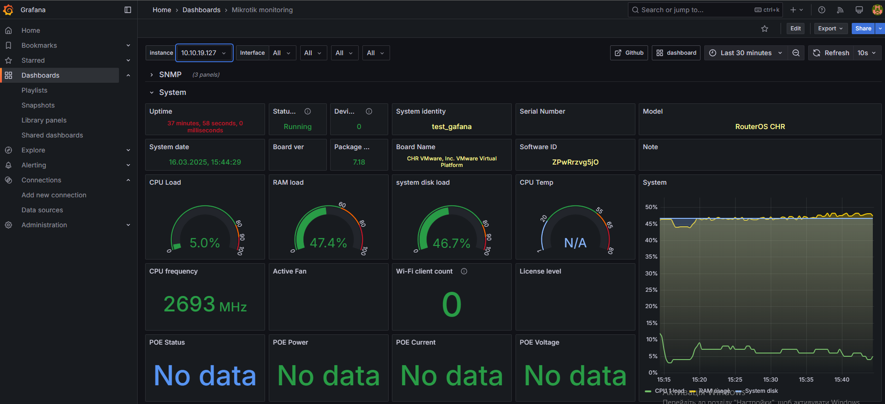

# Container with Grafana


This guide describes how to monitor Mikrotik devices using Prometheus+Grafana installed on RouterOS in a container. In this case on CHR, but this can be done on any device that supports containers or in the cloud. 
This method can also be used for other types of monitoring supported by Grafana and Prometheus.

Information about configuring containers in RouterOS can be found at the [link](https://help.mikrotik.com/docs/spaces/ROS/pages/84901929/Container). And about [Grafana](https://grafana.com/docs/grafana/latest/) and [Prometheus](https://prometheus.io/docs/introduction/overview/), respectively, at these links.


CHR is installed on a VMware virtual machine with the following parameters


---

Prerequisites for configuring RouterOS:

Internet access must be configured from the device.

Accurate time including time zone, i.e. ntp client, must be configured.


I will monitor Mikrotik devices using the SNMP protocol, so it needs to be configured.


```
/snmp
set enabled=yes trap-version=2
```
This needs to be done for each device that we will monitor.


The next step is to install the container package and activate it.

```
system/device-mode/update container=yes
```
To activate container mode, you must power off and then power on the virtual machine.


We create three VETH type interfaces.


```
/interface veth
add address=172.21.0.2/24 gateway=172.21.0.1 name=grafana
add address=172.21.0.3/24 gateway=172.21.0.1 name=prometheus
add address=172.21.0.4/24 gateway=172.21.0.1 name=snmp
```
Then we create a bridge and add the virtual interfaces that were created in the previous step to it.


```
/interface bridge
add name=Grafana_bridge
```


```
/interface bridge port
add bridge=Grafana_bridge interface=grafana
add bridge=Grafana_bridge interface=prometheus
add bridge=Grafana_bridge interface=snmp
```

We assign an IP address.


```
/ip address
add address=172.21.0.1/24 interface=Grafana_bridge network=172.21.0.0
```


Next, we create a makarade rule for the Grafana subnet and forwarding for containers with the corresponding ports.

```
/ip firewall nat
add action=dst-nat chain=dstnat dst-port=3000 in-interface=ether1 protocol=tcp to-addresses=172.21.0.2 to-ports=3000
add action=dst-nat chain=dstnat dst-port=9090 in-interface=ether1 protocol=tcp to-addresses=172.21.0.3 to-ports=9090
add action=dst-nat chain=dstnat dst-port=9116 in-interface=ether1 protocol=tcp to-addresses=172.21.0.4 to-ports=9116
add action=masquerade chain=srcnat src-address=172.21.0.0/24
```

On the container tab, click config and enter the appropriate settings.


```
/container config
set registry-url=https://registry-1.docker.io tmpdir=pull
```

Now you need to create environmental variables for each container with the appropriate name.


```
/container envs
add key=GF_PATHS_CONFIG name=grafana value=/etc/grafana/grafana.ini
add key=GF_PATHS_DATA name=grafana value=/var/lib/grafana
add key=GF_PATHS_HOME name=grafana value=/usr/share/grafana
add key=GF_PATHS_LOGS name=grafana value=/var/log/grafana
add key=GF_PATHS_PLUGINS name=grafana value=/var/lib/grafana/plugins
add key=GF_PATHS_PROVISIONING name=grafana value=/etc/grafana/provisioning
add key=GF_SECURITY_ADMIN_PASSWORD name=grafana value=admin
add key=GF_SECURITY_ADMIN_USER name=grafana value=admin
add key=GF_USERS_ALLOW_SIGN_UP name=grafana value=false
add key=PATH name=grafana value=/usr/share/grafana/bin:/usr/local/sbin:/usr/local/bin:/usr/sbin:/usr/bin:/sbin:/bin
add key=PATH name=prometheus value=/usr/local/sbin:/usr/local/bin:/usr/sbin:/usr/bin:/sbin:/bin
add key=PATH name=snmp value=/usr/local/sbin:/usr/local/bin:/usr/sbin:/usr/bin:/sbin:/bin
```
Well, you also need to create mounts for each container with a unique name.


```
/container mounts
add dst=/etc/grafana/provisioning/ name=grafana_provisioning src=/grafana/provisioning
add dst=/etc/snmp_exporter/ name=snmp_exporter_snmp src=/snmp
add dst=/prometheus name=prometheus_data src=/prometheus-data
add dst=/etc/prometheus name=prometheus_prometheus src=/prometheus
```

Now it's time to create containers.


```
container/add remote-image=grafana/grafana interface=grafana envlist=grafana hostname=grafana domain-name=grafana workdir="/usr/share/grafana" mounts=grafana_provisioning start-on-boot=yes
```


```
container/add remote-image=prom/prometheus interface=prometheus envlist=prometheus cmd="--config.file=/etc/prometheus/prometheus.yml --storage.tsdb.path=/prometheus --storage.tsdb.retention.time=30d" entrypoint=/bin/prometheus hostname=prometheus workdir="/prometheus" mounts=prometheus_data,prometheus_prometheus start-on-boot=yes
```


```
container/add remote-image=prom/snmp-exporter interface=snmp cmd="--config.file=/etc/snmp_exporter/snmp.yml" entrypoint=/bin/snmp_exporter hostname=snmp mounts=snmp_exporter_snmp start-on-boot=yes
```

Well, now all containers can be launched and connected to the external IP address of CHR on port 3000 - this is Grafana. 

username: admin
password: admin

Of course, there is no data there yet. To get the data there, you need to configure prometheus and snmp exporter.

Using an SFTP client, I will use Win SCP, connect to CHR on port 22 and replace the: 


/prometheus/prometheus.yml with [prometheus.yml](files/prometheus.yml)

/snmp/snmp.yml with [snmp.yml](files/snmp.yml)

/snmp/snmp_exporter with [snmp_exporter](files/snmp_exporter)


Important settings found in the prometheus.yml file are 
targets, i.e. the devices we will monitor
and replacement - snmp exporter.

Then restart all containers.

Let's go again to the external IP address of CHR on port 3000 and make the following settings.


In the Connection Prometheus server URL, enter
```
http://172.21.0.3:9090
``` 
this is the address and port of prjmetheus running in the container.

At the very bottom, click Save & test.

Now we add the Dashboard


Enter the dashboard ID 14420 and click Load


Now go to the Dashboard, select the imported dashboard, and in the instances, select the IP address of the device we want to see information about.

